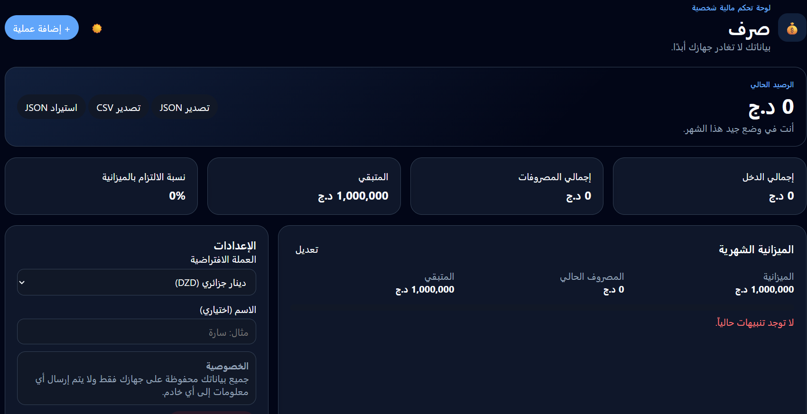

# صرف

Version 1.0.0

صرف هو تطبيق مجاني لإدارة الميزانية الشخصية يعمل بالكامل داخل المتصفح، بدون تسجيل دخول، وبدون أي خادم خلفي.

## المميزات

- تتبع الدخل والمصروفات
- إدارة الفئات والميزانية الشهرية
- بحث وتصفية العمليات
- رسوم بيانية بسيطة للعرض
- تصدير واستيراد البيانات بصيغة JSON/CSV
- وضع فاتح/داكن
- حماية الخصوصية: لا ترسل البيانات إلى أي خادم

## لقطة الشاشة



## التشغيل محليًا

يمكنك فتح الملف مباشرة في المتصفح أو تشغيل خادم محلي سريع:

```bash
python -m http.server 8000
```

ثم افتح:

```text
http://127.0.0.1:8000/
```

## النشر على GitHub Pages

1. أرسل المشروع إلى مستودع GitHub.
2. افتح إعدادات المستودع ثم Pages.
3. اختر مصدر النشر من فرع main أو master ومجلد الجذر.
4. انتظر حتى يتم نشر الموقع.

## ملاحظات مهمة

- البيانات تُخزن محليًا باستخدام LocalStorage في المتصفح.
- إذا مسحت بيانات المتصفح، ستفقد البيانات المخزنة.
- المشروع عبارة عن تطبيق ثابت بالكامل بدون backend.

## دعم المشروع

إذا كنت ترغب في دعم تطوير هذا المشروع، يمكنك استخدام إحدى طرق الدفع التالية. هذا القسم موجود في المستودع فقط حتى يبقى موقع التطبيق نظيفًا:

- **RedotPay**: رمز QR أو عنوان الدفع الخاص بك.
- **Binance Pay**: رمز QR أو عنوان المحفظة.
- **Monero (Cake Wallet)**: رمز QR أو عنوان محفظة Monero.


## Roadmap

- أهداف الادخار
- العمليات المتكررة
- PWA
- دعم لغات إضافية
- تحسين التحليلات

## الترخيص

هذا المشروع مرخص تحت رخصة MIT.
